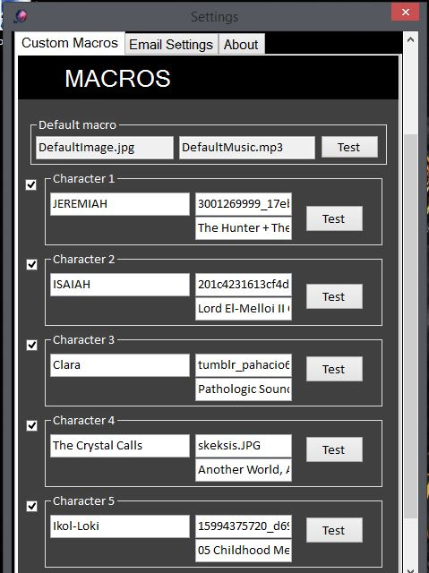

# Aldebaran Notifier

This now-defunct program utilized the IMAP protocol to hook into a user's email, check for unread emails with specific keywords from the Aldebaran forum, and display an image and play a song when it finds one. It was utilized by a small but dedicated group of roleplayers.

You can see a video demonstration of this [here](https://www.youtube.com/watch?v=4GosqcODUCY).

All code can be found under the [EmailRadioButton folder](./EmailRadioButton).

Gmail (and most other email hosts) has since removed IMAP capabilities for users for good reason, and so this program can no longer be used. It has, however, been uploaded here to Git as an example of a beginner C# project.

